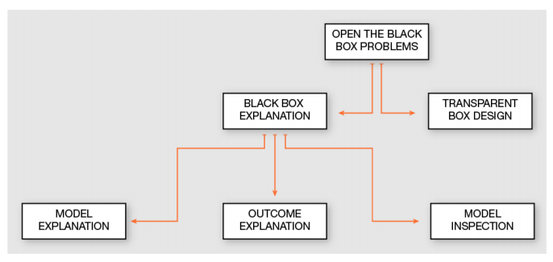

----
name: intro
---

# Explanation

## Data 2080
## drsmb.co/2080explanation

### take some time to stretch and move, since you're early

----
type: animate
name: goals
---

# By the end of class today,

--
1. Understand that you're supported and class will be ok
--
1. Understand how explaining black box models works
--
1. Evaluate the degree to which interpretability and explanation fulfill our bigger picture goals

----
type: animate
name: welcome
---

# Welcome to online class

--
1. Our goal is to support you
--
1. Breath in, breathe out
> class today will be a chance to get through
--
1. We want remote learning to be as high quality as in person
--
1. Some aspects will be different, we're all learning together
> let us know what works and what does not, so that we van learn together
--
1. At the end of class, I'll ask for feedback
> this exit ticket will be used to summarize feedback and shared with other DSI instructors so that we can all work together to make it work as well as possible.
--
----
name: tools
---

## Tools
1. Zoom
> we will use zoom for each synchronous class session
1. Slack
>
1. shared notes for each class session
1. Shared Course Google Drive

## Office Hours
- via Zoom, same times

----
name: breathe
---

# Deep breath
> back to that point, we will give you a few minutes to let out whatever you need in order to get to our content for the day. this activity will have two goals, we'll also practice with breakout rooms that we will use for in class activities.
- Try breakout rooms
- Chat about whatever is on your mind not related to class

----
name: agenda
---

# Agenda

1. Review
1. Post hoc explanatations overview
1. Deep dive: TCAV for tensorflow
1. Do the tools we have for explanation meet our goals?
<!-- 1. trolley problems of explanation -->

----
type: animate
name: review
---

# Themes in your Questions from last week

_you all asked really great questions_

--
- Interpretability, Accuracy, and Complexity
--
- Model Reconstruction
--
- Interpretability as a means to other goals?
--
- Interpretability for who? and governance
--
- Consensus building
--
- Do we really need this?

----
name: warmupreadings
---

# Discuss Survey Paper

List the dichotomies/ choices you have in explanable models
> using a google slides file with a table, fill in the different types of comparisons that you came across in the reading

----
type: animate
name: openbbtypes
---

# Opening the Black Box

--
- Model Explanation
--
- Model Inspection
--
- Outcome Explanation

----
name: openbbtaxonomy
---

# Opening the Black Box Taxonomy

----
type: animate
name: dimensions
---

# Dimensions of the Explanation

- problem or goal (model explanation, outcome explanation, model inspection, transparent design)
- explanator type
- black box type
- data type
--
- specific or general
--
- global vs local
- actions of the model vs inputs of the model

----
name: model
---

# Model Explanation

## Strategies
- global solution
- typically approximation via interpretable by fiat model
  - decision trees
  - rule extraction
  - feature importance ranking measure
- in terms of actions or inputs

## When do we want this?

----
name: outcome
---

# Outcome Explanation

- Saliency Maps
- ExpainD graphical explanation
- LIME

## When do we want this?

----
name: inspection
---

# Model Inspection

- sensitivity analysis
- partial dependence
- activation maximization

## When do we want this?

----
name: saliency
---

# Saliency Maps

----
name: tcav
---

# TCAV

[TCAV slides](https://beenkim.github.io/slides/TCAV_ICML_pdf.pdf)

----
name: debates
---

# Should we do this?

----
name: trolley
---

----
name: contribute
---
# Assignment: Contribute Materials

## Choose one:
- articles or anectdotes on why
- implementations or tools

## Include:
- 1 sentence precis
- up to 1 paragraph evaluation/ your opinion
- comment on 2 others

----
name: bias
---

# After Break: Fairness and Bias

- first two weeks after break
- readings will be posted tonight

----
name: exit
---

## [Exit Ticket](https://forms.gle/JdWtBU7BBaCnMjBV6)

Give us feedback to use as we prepare
